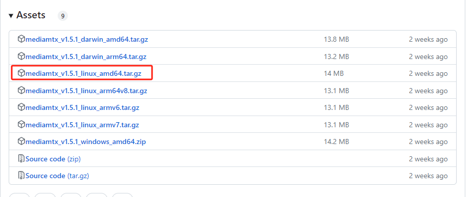

# 环境搭建

适用环境Ubuntu20.04

## 安装ffmpeg

### 源码下载

```
git clone https://github.com/FFmpeg/FFmpeg.git
git checkout release/4.3

```

### 环境配置

```
./configure --prefix=/usr/local/ffmpeg --enable-shared --enable-gpl --enable-version3 --enable-sdl2 --enable-fontconfig --enable-gnutls --enable-iconv --enable-libass --enable-libbluray --enable-libmp3lame --enable-libopencore-amrnb --enable-libopencore-amrwb --enable-libopus --enable-libshine --enable-libsnappy --enable-libsoxr --enable-libtheora --enable-libtwolame --enable-libvpx --enable-libwebp --enable-libx264 --enable-libx265 --enable-libxml2 --enable-lzma --enable-zlib --enable-gmp --enable-libvorbis --enable-libvo-amrwbenc --enable-libspeex --enable-libxvid --enable-libaom --enable-libopenmpt --enable-libfdk-aac --enable-nonfree
```

### 编译安装

```
make
sudo make install
```

### 配置环境变量

```
vim ~/.bashrc
export PATH=/usr/local/ffmpeg/bin:$PATH
export LD_LIBRARY_PATH=/usr/local/ffmpeg/lib:$LD_LIBRARY_PATH
```


## 安装Opencv

### 源码下载

```
git clone https://github.com/opencv/opencv.git
```

### 编译安装

```
cd opencv
mkdir build
cd build
cmake -D CMAKE_BUILD_TYPE=RELEASE -D CMAKE_INSTALL_PREFIX=/usr/local -D OPENCV_EXTRA_MODULES_PATH=../../opencv_contrib/modules .. -D WITH_FFMPEG=ON
make
sudo make install
```

## 安装RTSP服务器

### 资源包下载

```
https://github.com/bluenviron/mediamtx/releases
```




### 解压运行RTSP服务器

```
tar -xf mediamtx_v1.5.0_linux_amd64.tar.gz
./mediamtx
```


## 调试运行demo

### 解压demo

```
tar -xvf FFmpegAndOpenCVPushRTSP.tar.gz
```

### 编译RTSP推流demo

```
cd FFmpegAndOpenCVPushRTSP
mkdir build
cd build
cmake ..
make
./RTSPStream
```

